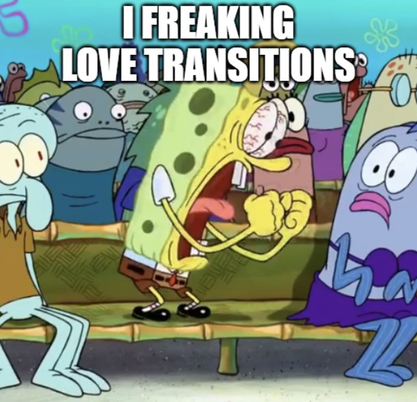

Un mensaje que desmitifica la suplementación
En una reciente entrevista, el experto en nutrición y entrenamiento Ismael Galancho compartió una reflexión contundente: “Los suplementos son las guindas del pastel, no la base”. Esta metáfora, sencilla pero poderosa, resume su visión sobre el papel secundario de estos productos en la salud y el rendimiento. Analizamos sus argumentos, basados en evidencia científica, para entender por qué priorizar lo esencial —alimentación, ejercicio y descanso— es la clave del éxito, y cuándo los suplementos pueden sumar valor sin caer en mitos 24.

## What is a gradient underline?

It looks like this!

<div class="relative pb-4">
	<span class="absolute inset-x-1 -bottom-px h-px bg-gradient-to-r from-sky-500/0 via-sky-500/70 to-sky-500/0"></span>
</div>

## How to create a gradient underline

We create this as an `absolute` positioned element, which requires the parent element to be `relative`. This allows us to position the element relative to the parent (surpise). In this case we are going to have it underline the parent element, although you could adjust this positioning.

### Gradient underline color

We're going to use the `bg-gradient-to-r` utility to create a gradient from left to right. Direction really doesn't matter, the point is that it's a gradient. For the starting color we're going to make it transparent, go to your desired color, and go back to transparent. We can do this with the utilities `bg-gradient-to-r from-sky-500/0 via-sky-500/70 to-sky-500/0`. This will create a gradient from transparent to `sky-500` to transparent. You can adjust the opacity of the middle color to whatever you want. I chose `70` because it looked good to me.

### Gradient underline height

Let's set the height of the underline to `h-px`. This will make it 1px tall. You can adjust this to whatever you want.

### Positioning the gradient underline

We want the gradient underline to span the bottom edge of the parent element. So the first utility we want to use is `inset-x-0` to have it go from the left edge to the right edge, then `bottom-0` to put it at the bottom. You can find more info about these utilities in the [Tailwind Docs](https://tailwindcss.com/docs/top-right-bottom-left#placing-a-positioned-element).

If you need to adjust the vertical location of the underline, you can do so using the `bottom` utility. For instance, if you want to move it down slightly to overlap a bottom border, you can use `-bottom-px` to move it down 1px.

## Final code

### Generic gradient underline

Here I use the color `sky-500` from the Tailwind color palette. You can use whatever color you want.

```html
<div class="relative">
	<span
		class="absolute inset-x-0 bottom-0 h-px bg-gradient-to-r from-sky-500/0 via-sky-500/70 to-sky-500/0"
	></span>
</div>
```

### Link underline on hover

This is very similar to the above, but I've added a hover effect to the underline. There's also a transition because who doesn't like transitions?



```html
<button class="group relative border-2 p-2">
	My Link!
	<span
		class="absolute inset-x-0 -bottom-px h-px bg-gradient-to-r from-sky-500/0 via-sky-500/70 to-sky-500/0 opacity-0 transition group-hover:opacity-100"
	></span>
</button>
```
